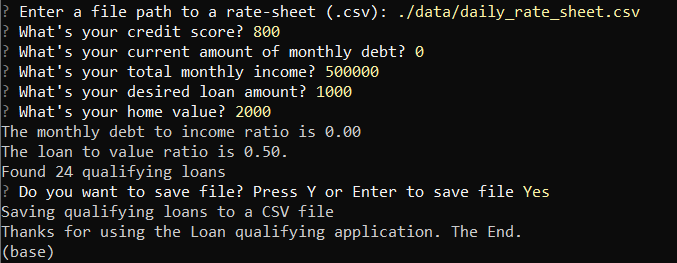

# Project Title: Lending Software

The project is a lending software that is a python-based command-line interface. The application allows users to input their relevant information to find a list of qualifying home loans from lenders and export it to a saved file by taking in the 'daily_rate_sheet' from various loan providers. This will allow increased efficiency for users creating a more stream-lined process when looking for qualifying home loans. 


---

## Technologies:

The project uses python 3.7 with the following packages:

* [fire](https://github.com/google/python-fire) - For the command line interface, help page, and entrypoint.

* [questionary](https://github.com/tmbo/questionary) - For interactive user prompts and dialogs
Describe the technologies required to use your project such as programming languages, libraries, frameworks, and operating systems. Be sure to include the specific versions of any critical dependencies that you have used in the stable version of your project.

* [ast](https://docs.python.org/3/library/ast.html) - For processing trees of the Python abstract syntax grammar. Comes under Python's standard utility modules

* [sys](https://docs.python.org/3/library/sys.html) - For accessing some variables used by the interpreter and functions that interact strongly with the interpreter. Comes under Python's standard utility modules

* [pathlab](https://docs.python.org/3/library/pathlib.html) - For providing filesystem paths with semantics appropriate for different operating systems. Comes under Python's standard utility modules

* [csv](https://docs.python.org/3/library/csv.html) - For implementing classes to read and write tabular data in CSV format. Comes under Python's standard utility modules


---

## Installation Guide

In this section, you should include detailed installation notes containing code blocks and screenshots.

Before running the application first install the following dependencies:

```python
  pip install fire
  pip install questionary
```

---

## Usage

To use the lending software simply clone the repository and run the **app.py** with:

```python
python app.py
```

Upon launching the loan qualifier application you will be greeted with the following prompts.




---

## Contributors

Jung Kim aka CHAOS
github.com/chaos4us

---

## License

MIT License
